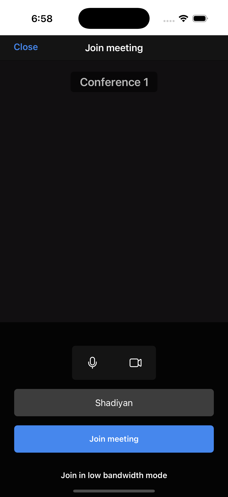

# Jitsi prototype

A simple ios app for video conferencing using jitsi meet sdk

## What it does

- Lets you enter your name and a room id
- Joins a video conference with other people
- Works on ios 15.1+

## How to run

1. Open `JitsiPrototype.xcworkspace` in xcode (not the .xcodeproj!)
2. Make sure you have cocoapods installed (`brew install cocoapods`)
3. Run `pod install` if pods folder is missing
4. Build and run on simulator or device
5. Enter your name and room id, then tap "start conference"

## Screenshots

  

*main screen - filled form - video interface*

  

*conference view - participant list - more options*

## Notes

- Needs camera and microphone permissions
- Uses jitsi meet sdk version 11.3.1
- Built with swiftui